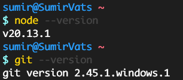

# Documentation and Guidelines

## Setup and Installation

1. For the purpose of this project, we need the following installed on our systems:

   - [Git](https://git-scm.com/downloads)
   - [NodeJS](https://nodejs.org/en)
   - A text editor of your choice (we shall use [VS Code](https://code.visualstudio.com/) - but feel free to use the one of your choice)

   `NOTE - If you are on Windows, make sure to update your PATH`

   Check if you have correctly installed by running the following commands:

   ```
   node --version
   git --version
   ```

   You should see an output like this:

   

2. Next, go ahead and create a [GitHub](https://github.com/) account.

3. Run the following commands to configure git on your system

   ```
   git config --global user.name "Your Name"
   git config --global user.email "youremail@email.com"
   ```

   `The email you enter here has to be the same with which you created your GitHub account`

4. Setup your GitHub account and add an SSH key. Follow [this](https://docs.github.com/en/authentication/connecting-to-github-with-ssh/adding-a-new-ssh-key-to-your-github-account) guide.

5. Fork this repository


6. Clone the forked repository with this command:

   ```
   git clone ...
   ```

   <!-- TODO: Add clone command -->

7. Open the repository in your favorite text editor/IDE.

8. Install npm dependencies of the project by running the following command in the project's root directory:

   ```
   npm install
   ```

9. Now that the dependencies are installed, you can view the working demo of the page by running:
   ```
   npm run dev
   ```
   Navigate to http://localhost:5173 to view the output

**Hurray!! You are now ready to contribute to the project**

## How to Contribute

`Skip Steps 1 - n if you followed the steps from Setup and Installation`

1. Make sure to fork this repository into your GitHub account - this way you will be able to create Pull Requests to merge your code in the repository.

2. Clone the forked repository in your system

3. Run `npm install` in the root directory of the cloned repository.

4. Make the changes you want to do.

5. Once you are done, commit your code to git using the following commands:

   ```
   git add .
   git commit -m "A useful commit message"
   ```

6. Push your commits to your GitHub repository

   ```
   git push -u origin master
   ```

7. Make a Pull Request

**That's it!** The PR you made would be reviewed by a Team Member of ours, and based on the code you have written the PR would be requested for changes, if any, and eventually Merged!
